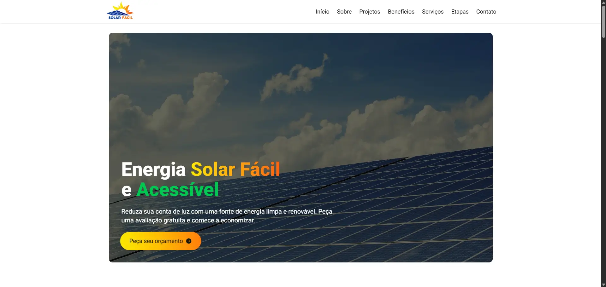
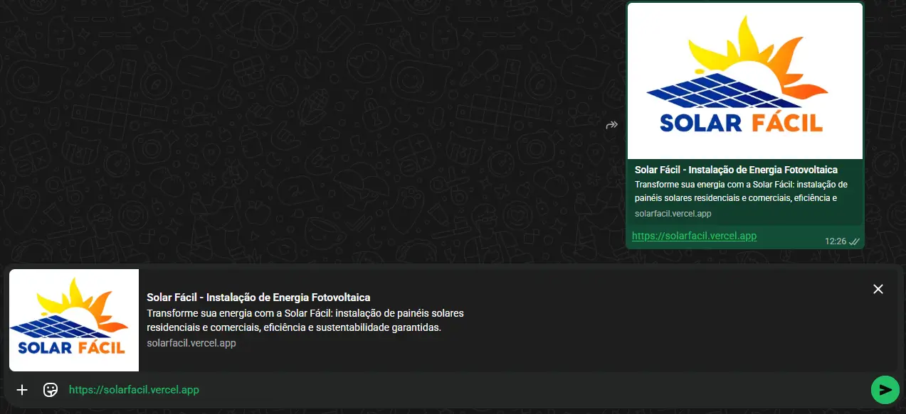
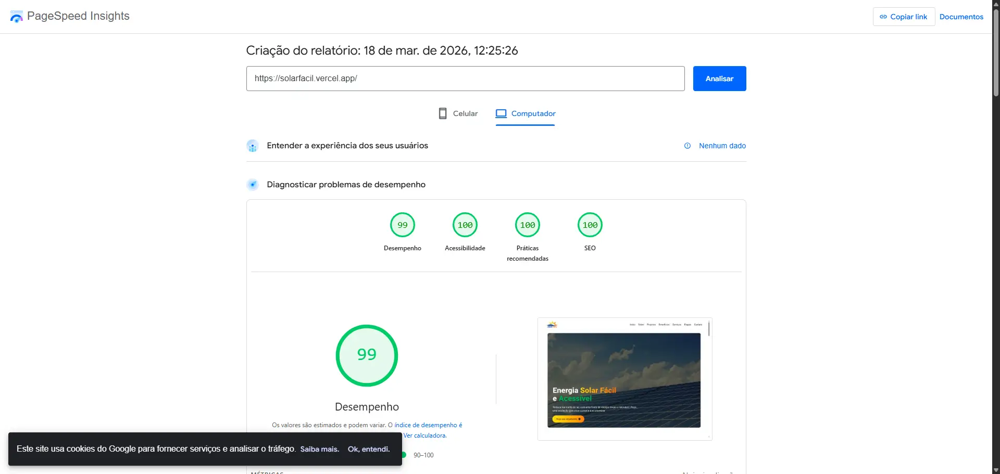
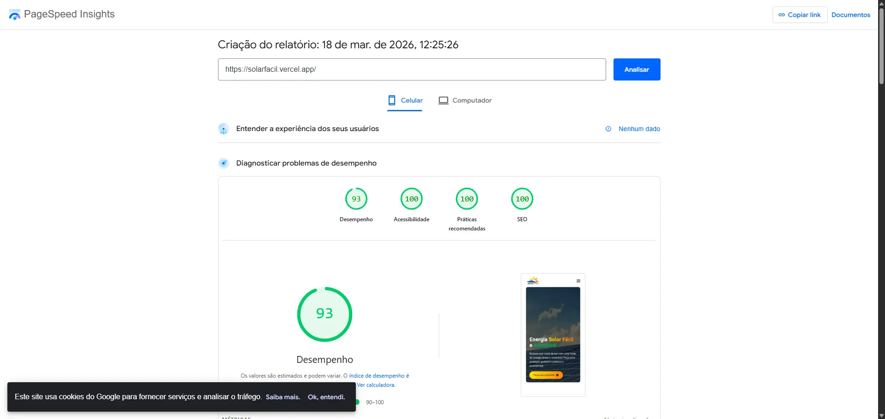

# ☀️ Solar Fácil - Landing Page

Landing page desenvolvida para a Solar Fácil com foco em **performance, SEO e escalabilidade**, utilizando tecnologias modernas do ecossistema front-end.

---

## 🚀 Demonstração

🔗 Acesse o projeto:  
https://solarfacil.vercel.app/

---

## 🎥 Preview do Projeto






---

## 📌 Sobre o Projeto

A proposta deste projeto foi desenvolver uma landing page moderna e eficiente para uma empresa do setor de energia solar.

O foco foi criar uma aplicação:
- Rápida
- Otimizada para mecanismos de busca (SEO)
- Preparada para crescimento futuro (site institucional completo)

---

## 🛠 Tecnologias Utilizadas

- **Next.js**
- **TypeScript**
- **Tailwind CSS**

---

## ⚙️ Funcionalidades e Diferenciais

- ⚡ Alta performance (otimização para PageSpeed)
- 🖼 Otimização de imagens
- 🔍 SEO técnico aplicado desde a base
- 🔗 Open Graph configurado (melhor preview ao compartilhar links)
- 📱 Layout totalmente responsivo
- 🧱 Estrutura escalável para futuras expansões

---

## 🎯 Objetivo

Mais do que uma landing page visualmente agradável, o objetivo foi entregar uma aplicação:

- Rápida
- Bem estruturada
- Otimizada
- Pronta para evolução

---

## 📊 Performance

O projeto foi desenvolvido com foco em atingir **altas pontuações no Google PageSpeed Insights**, garantindo:

- Carregamento rápido
- Boa experiência do usuário
- Melhor ranqueamento em buscas

---

## 💻 Como rodar o projeto localmente

```bash
# Clone o repositório
git clone https://github.com/lucasfgaldinos/solar-facil.git

# Acesse a pasta
cd solar-facil

# Instale as dependências
npm install

# Rode o projeto
npm run dev